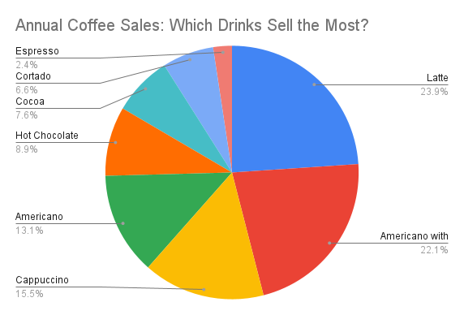

# Coffee Sales Analysis  

## **Ask**

The goal of this project is to understand **coffee sales trends across a full year** to help a business owner make informed decisions about:

- Which beverages sell the most  
- What times of day are the busiest  

Key questions:

1. *Which coffee beverages generate the highest sales?*  
2. *What hours of the day have the highest customer demand?*

---

## **Prepare**

The dataset was retrieved from **Kaggle** and includes:

- Timestamps for each transaction  
- Sales amounts  
- 8 distinct beverage types  

**Tools Used**

- **SQL** — for analyzing the raw data  
- **Google Sheets** — for creating visualizations  

---

## **Process**

Before analyzing the data, I completed the following cleaning steps:

- Checked for duplicates → **none remained**  
- Removed null values → **2 rows deleted**  
- Ensured no empty rows/columns  
- Verified consistent formatting  

### Data Preparation Using SQL

- Extracted the **hour** from each timestamp  
- Aggregated sales by **beverage type**  
- Aggregated total sales by **hour of the day**

The dataset was then ready for visualization.

---

## **Analyze**

### **1. Coffee Sales by Beverage**

I aggregated total sales by beverage type and created a pie chart.

**Key Insights**

- **Lattes** are the top-selling beverage  
- **Americanos with milk** follow closely  
- These drinks are strong candidates for promotions and product bundling  

---

### **2. Total Sales by Hour of the Day**

Using SQL, I extracted hourly sales trends and visualized them in Google Sheets.

**Key Insights**

- Peak sales occur at **10 AM** (over **10k**)  
- A secondary afternoon peak appears at **4 PM** (~9k)  
- These patterns highlight critical hours for staffing and preparation

---

## **Share / Act**

I compiled the visualizations and insights into this GitHub README to clearly communicate the findings.  
Based on the analysis, a coffee shop could:

- Focus inventory planning on top-selling beverages like **Lattes** and **Americanos with milk**  
- Offer targeted promotions or pair these drinks with pastries to increase revenue  
- Schedule additional staff during the busiest hours (**10 AM** and **4 PM**)  
- Use slower hours for prep, restocking, and equipment maintenance  

These actions can directly improve efficiency, customer experience, and sales performance.

