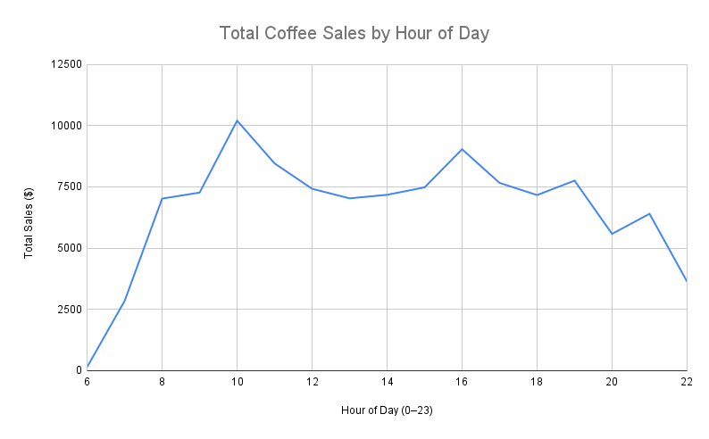

# Coffee Sales Analysis

This project analyzes coffee sales data using SQL and simple visualizations in Google Sheets.  
The goal is to uncover patterns in customer behavior and sales trends that could help inform business decisions.

## Data Cleaning

Before starting the analysis, I performed basic data cleaning steps to make sure the dataset was ready:

- Checked for duplicates and confirmed none remained.  
- Identified and removed null values (only 2 rows with missing data, which were deleted).  
- Verified no empty rows or columns remained after cleaning.  
- Confirmed the dataset is consistent and ready for analysis.

## Planned Analysis

### 1. Sales by Hour of the Day

Using SQL, I extracted the hour from each sale’s timestamp to see what times of day customers buy the most coffee.

**Visualization:**  

The line graph shows the sales trend across the entire year by hour of the day.  
Coffee sales peak a little over 10k at **10 AM**, drop off slightly afterward, and then rise again to around 9k at **4 PM**.  
This helps inform general staffing needs, as the business would require the most staff during these peak hours.

---

### 2. Coffee Sales by Beverage (Pie Chart)

To explore which drinks sell the most, I created a **pie chart** showing the percentage of total sales for each coffee beverage.

The chart shows that **Lattes are the top-selling drink**, followed closely by **Americanos with milk**.  
This insight highlights opportunities to:

- **Pair Lattes with pastries** to increase transaction value  
- **Offer special promotions on Lattes** to boost sales further  

By understanding which drinks dominate sales, the business can better plan marketing campaigns, manage inventory, and create bundles that appeal to customers.

---

## Tools

- **SQL** → to query and analyze the raw data.  
- **Google Sheets** → to create simple, clear visualizations from query results.  
- **GitHub** → to document the process and share the project.

## Next Steps

- Finalize the second analysis.  
- Run SQL queries and export results.  
- Create charts in Google Sheets.  
- Add insights and conclusions based on the findings.
