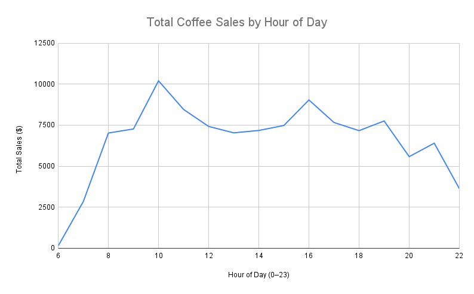

# Coffee Sales Analysis

This project analyzes coffee sales data I retrieved from Kaggle. Based on the data available, I think it would be helpful as a business owner to know sales trends across the whole year to identify the busiest times of the day in general. In addition, the data includes sales amounts for 8 distinct beverage types. Knowing which beverages sell the most could help inform decisions on promotions and product inventory. 
## Data Cleaning

Before starting the analysis, I performed basic data cleaning steps to make sure the dataset was ready:

- Checked for duplicates and confirmed none remained.  
- Identified and removed null values (only 2 rows with missing data, which were deleted).  
- Verified no empty rows or columns remained after cleaning.  
- Confirmed the dataset is consistent and ready for analysis.

## Tools Used

- **SQL** → to query and analyze the raw data.  
- **Google Sheets** → to create simple, clear visualizations from query results.  
- **GitHub** → to document the process and share the project.

##  Analysis

### 1. Coffee Sales by Beverage (Pie Chart)

To explore which drinks sell the most, I created a **pie chart** showing the percentage of total sales for each coffee beverage.

The chart shows that **Lattes are the top-selling drink**, followed closely by **Americanos with milk**.  
This insight highlights opportunities to:

- **Pair Lattes with pastries** to increase transaction value  
- **Offer special promotions on Lattes** to boost sales further  

By understanding which drinks dominate sales, the business can better plan marketing campaigns, manage inventory, and create bundles that appeal to customers.

---

### 2. Sales by Hour of the Day (Line Graph)

Using SQL, I extracted the hour from each sale’s timestamp to see what times of day customers buy the most coffee.

**Visualization:**  

The line graph shows the sales trend across the entire year by hour of the day.  
Coffee sales peak a little over 10k at **10 AM**, drop off slightly afterward, and then rise again to around 9k at **4 PM**.  
This helps inform general staffing needs, as the business would require the most staff during these peak hours.

---

## Conclusion

This analysis provided insights into both what customers are buying and when they are buying it. Lattes and Americanos with milk drive the highest percentage of sales, making them key products for promotions, bundling, and inventory planning. Sales trends by hour highlight peak demand around 10 AM and 4 PM, which can guide staffing and scheduling decisions.

